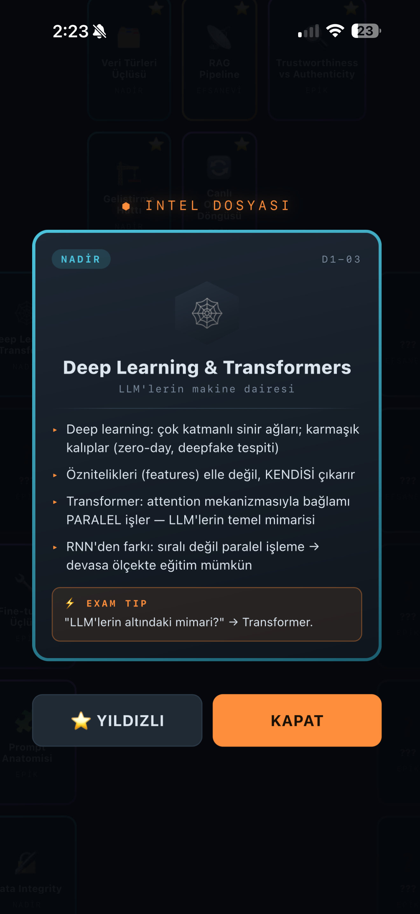
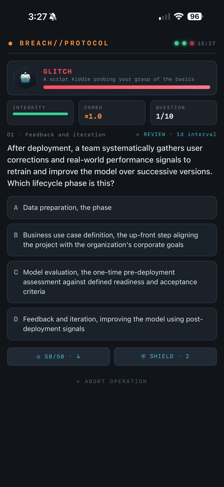

# ⬢ BREACH // PROTOCOL

**An ADHD-friendly, gamified study app for the CompTIA SecAI+ (CY0-001) certification.**
Learn the material through a cybersecurity roguelite — spaced repetition and active recall, disguised as a game you actually want to open.

[](https://YOUR-USERNAME.github.io/breach-protocol/)
[](LICENSE)
[](data/LICENSE-CONTENT.md)
[](#-install-on-your-phone)

> ⚠️ **Unofficial & independent.** This project is **not** affiliated with, endorsed by, or sponsored by CompTIA. "CompTIA" and "SecAI+" are trademarks of their respective owners. All questions are **original study material** generated with AI from the publicly published exam objectives — they are **not** real exam questions.

---

## Why this exists

Studying for a certification with a 600-page PDF is the opposite of how an ADHD brain works. BREACH // PROTOCOL turns the SecAI+ syllabus into short, dopamine-driven rounds you can play in 5 minutes on a train — while a real **SM-2 spaced-repetition engine** quietly makes the knowledge stick.

Two evidence-based learning methods are baked into the core loop:

- **Spaced Repetition (SM-2):** Each question has its own forgetting curve. Get it right and it comes back in 1 day → 3 days → ~8 → ~21 → weeks. Get it wrong and it resets. You review things exactly when you're about to forget them.
- **Active Recall:** Once you've answered a question correctly twice, the multiple-choice options disappear. You have to *retrieve* the answer from memory, then grade yourself — because recognizing an answer isn't the same as knowing it.

## Features

- 🎯 **637 original practice questions** across all four SecAI+ domains (a 312-question Master set + a 325-question HARD set), weighted toward the real exam blueprint (17 / 40 / 24 / 19%)
- 🧠 **Full SM-2 algorithm** with date-based scheduling, e-factor tracking, and quality grading (Forgot / Hard / Good / Easy)
- 🃏 **70 collectible Intel Cards** — micro-briefings distilled from the objectives, with 4 rarity tiers, holographic foils, and 3D flip animations. Covers all 217 exam objectives.
- 🎓 **Certification exam simulator** — timed, blueprint-weighted, flagging + question palette, full post-exam report with per-domain breakdown
- 📈 **Readiness score** — one number that tells you if you're ready, blending exam history, accuracy, and mastery
- 👾 **Roguelite layer** — domain bosses, combo multipliers, integrity bar, joker power-ups, daily missions, rank progression
- 📱 **Installable PWA** — works fully offline once installed; perfect for commutes
- 💾 **Save export/import** — back up or move your progress across devices with a single code
- 🗂️ **Multiple question sets** — a 312-question Master pool and a 325-question HARD pool (tougher, scenario-heavy, all domains), each with fully separate progress

## 📸 Screenshots

<!-- Add your screenshots to docs/ and update these paths -->
| Command Center | Intel Card | Exam Report |
|:---:|:---:|:---:|
|  |  |  |

## 📲 Install on your phone

**iPhone (recommended):**
1. Open the [live site](https://YOUR-USERNAME.github.io/breach-protocol/) in Safari (once, with internet)
2. Tap **Share → Add to Home Screen**
3. Launch from the icon — it now runs full-screen and **fully offline**

**Android:** Chrome will prompt "Install app" automatically, or use the ⋮ menu → Install.

Your progress is saved locally on the device. Use **Stats → Backup/Restore** to move it between devices or keep a safe copy.

## 🛠️ Run locally / develop

This is a single static file — no build step required.

```bash
git clone https://github.com/YOUR-USERNAME/breach-protocol.git
cd breach-protocol
# serve the folder with any static server, e.g.:
python3 -m http.server 8000
# open http://localhost:8000
```

The questions live in [`data/`](data/) as readable JSON, separate from the app code. See [CONTRIBUTING.md](CONTRIBUTING.md) to add or fix questions.

## 🗺️ Roadmap

- [ ] Split the monolithic HTML into ES modules (Vite) for easier contribution
- [ ] Optional cloud sync (Supabase/Firebase free tier)
- [ ] Community question review pipeline
- [ ] Additional language packs for the UI

## 🙏 Acknowledgements

The broader CompTIA SecAI+ study community made this possible. Special thanks to
[Josh Madakor](https://www.youtube.com/@JoshMadakor), whose freely shared SecAI+
study materials and Anki decks are a fantastic resource for anyone preparing for
this exam — go check out his channel.

> **Want a larger question pool?** The app supports multiple question sets. Drop
> an additional `data/questions-core.json` (same schema as
> `questions-master.json`) and rebuild — the app automatically shows a set
> switcher. Only include content you have the rights to redistribute.

## 🤝 Contributing

Contributions are very welcome — especially question quality fixes and new questions. Please read [CONTRIBUTING.md](CONTRIBUTING.md) first. The golden rule: **never submit real or remembered exam questions.** Everything here must be original study material derived from the public objectives.

## 📄 License

- **Code:** [MIT](LICENSE)
- **Questions & card content:** [CC BY 4.0](data/LICENSE-CONTENT.md)

## ⚖️ Disclaimer

This is an independent, unofficial study aid. It is not affiliated with, authorized, endorsed by, or sponsored by CompTIA, Inc. "CompTIA" and "SecAI+" are trademarks of CompTIA, Inc. All practice questions are original works generated with AI assistance from the publicly available [exam objectives](https://www.comptia.org/) and are **not** actual certification exam questions. Using this tool does not guarantee passing any exam. Always rely on official CompTIA materials as your primary source.
